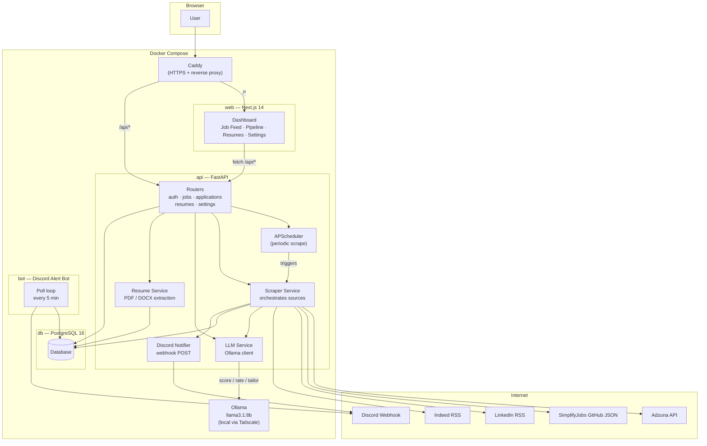

# ATS Discord System — Architecture

## System Overview

A self-hosted job application tracker for new grad CS roles. Scrapes 4 job boards on a schedule, scores every job with a local LLM, and pushes alerts to Discord. A Next.js dashboard manages the full application pipeline.

---

## Component Map



---

## Request Flows

### 1. Scheduled Scrape (every N minutes)
```
APScheduler
  → run_all_scrapers()
    → fetch_jobs() × 4 sources (Adzuna, SimplifyJobs, LinkedIn RSS, Indeed RSS)
    → for each new job:
        score_job()   → Ollama /api/generate  → relevance_score, tags, experience_level
        rate_resume() → Ollama /api/generate  → resume_score strengths/weaknesses
        if score ≥ threshold → notify_new_job() → Discord webhook POST
    → batch-commit to PostgreSQL every 10 jobs
```

### 2. Manual Scrape (user-triggered)
```
POST /api/jobs/scrape
  → FastAPI BackgroundTask → same run_all_scrapers() pipeline
```

### 3. Resume Tailoring
```
POST /api/resumes/{id}/tailor  { job_id }
  → extract job description + resume text from DB
  → tailor_resume() → Ollama /api/generate (temp=0.3, up to 2000 tokens)
  → save tailored DOCX to disk (uploads/tailored/)
  → store Resume row in DB
  → return { task_id } for polling
GET /api/resumes/tailor/{task_id}
  → poll status → return download URL when ready
```

### 4. Discord Alert (bot path)
```
bot.py (every 300 s)
  → SELECT jobs WHERE notified=false AND score ≥ threshold LIMIT 20
  → POST embed to Discord webhook
  → UPDATE jobs SET notified=true
```

---

## Data Model

```
jobs                  ← central entity, one row per unique posting
  id (uuid PK)
  external_id (unique) ← dedup key (source-specific hash/url)
  source               ← adzuna | simplify | linkedin_rss | indeed_rss
  title, company, location, remote, url, description
  salary_min, salary_max
  tags[]               ← tech skills extracted by LLM
  relevance_score      ← 0.0–1.0, LLM-assigned
  score_reasoning
  experience_level     ← intern | entry | mid | senior | unknown
  status               ← new | bookmarked | dismissed
  notified             ← whether Discord alert was sent
  posted_at, scraped_at

applications          ← user's pipeline tracking
  id, job_id (FK)
  stage                ← interested | applied | phone_screen | technical |
                          onsite | offer | rejected | withdrawn
  next_action_date
  notes[]              → application_notes (separate table)

resumes
  id, filename, file_path
  is_master            ← true = uploaded by user; false = tailored output
  extracted_text       ← plain text for LLM input
  tailored_for (FK → jobs)

resume_scores         ← how well each master resume matches each job
  resume_id, job_id (unique pair)
  score, strengths[], weaknesses[]

scrape_runs           ← audit log per source per run
  source, started_at, finished_at, jobs_found, jobs_added, error

app_settings          ← single-row config (id=1)
  score_threshold      ← minimum score to trigger Discord alert
  scrape_interval_minutes
  discord_webhook_url
  ollama_model         ← tailoring model override
  ollama_scoring_model ← scoring model override
```

---

## Service Responsibilities

| Service | File | What it does |
|---|---|---|
| `llm.py` | `api/app/services/llm.py` | Ollama HTTP client; `score_job()`, `rate_resume()`, `tailor_resume()` |
| `scraper.py` | `api/app/services/scraper.py` | Orchestrates sources, dedup, LLM calls, DB writes, Discord notify |
| `discord_notifier.py` | `api/app/services/discord_notifier.py` | POSTs rich embeds to Discord webhook |
| `resume.py` | `api/app/services/resume.py` | PDF/DOCX → plain text extraction for LLM input |
| `sources/adzuna.py` | `api/app/services/sources/` | Adzuna REST API → normalized job dicts |
| `sources/simplify.py` | — | SimplifyJobs GitHub JSON → normalized job dicts |
| `sources/linkedin_rss.py` | — | LinkedIn RSS → normalized job dicts |
| `sources/indeed_rss.py` | — | Indeed RSS → normalized job dicts |
| `scheduler.py` | `api/app/scheduler.py` | APScheduler setup; registers scrape job with configurable interval |
| `bot.py` | `bot/bot.py` | Standalone container; polls DB, fires Discord embeds |

---

## Deployment Topology

```
Internet
  │
  ▼
Caddy :443  (Let's Encrypt TLS, HSTS)
  ├── /api/*  ──► FastAPI :8000
  │                  ├── PostgreSQL :5432 (internal only)
  │                  └── Ollama :11434 (local machine via Tailscale)
  └── /*  ─────► Next.js :3000

Discord Bot (separate container)
  ├── PostgreSQL :5432 (read + update notified flag)
  └── Discord webhook HTTPS

File storage: local volume (uploads/) mounted into api container
```

### Key security properties
- JWT in `HttpOnly; Secure; SameSite=Strict` cookie — not accessible to JS
- Ollama not exposed externally — internal network only (or Tailscale)
- PostgreSQL port not mapped in production compose
- `.env` gitignored; `.env.example` has only placeholders

---

## LLM Usage

| Operation | Model (default) | Temp | Max tokens | Notes |
|---|---|---|---|---|
| Job scoring | `llama3.1:8b` | 0.1 | 350 | Structured JSON output; desc truncated to 800 words |
| Resume rating | `llama3.1:8b` | 0.1 | 400 | Resume truncated to 600 words, JD to 400 |
| Resume tailoring | `llama3.1:8b` | 0.3 | 2000 | Full rewrite; timeout configurable via `OLLAMA_TIMEOUT` |

Both model names are overridable per-operation via `app_settings`.
